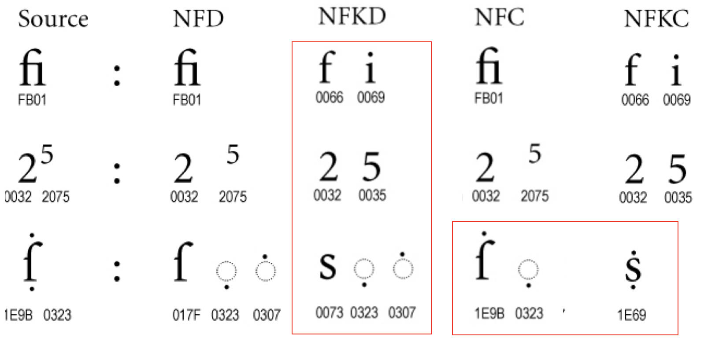
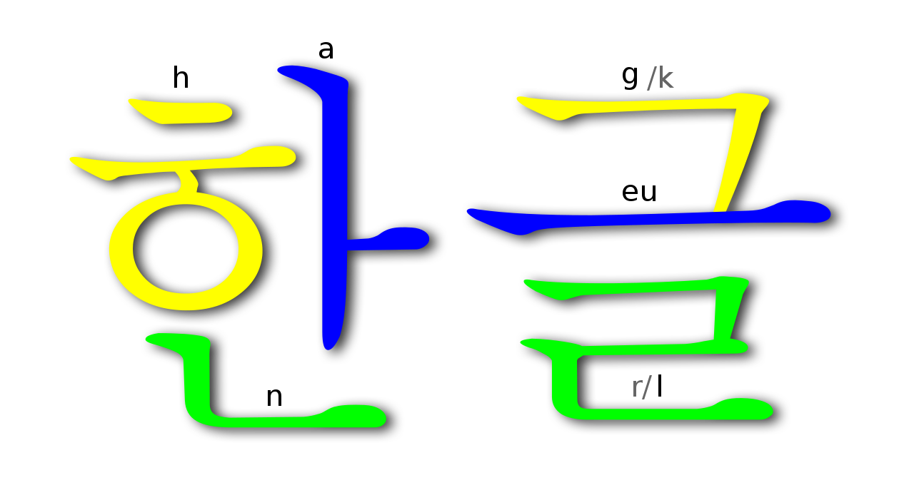
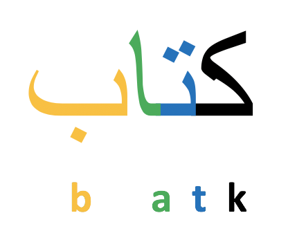
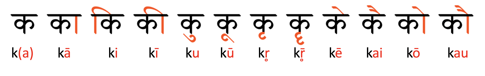

# Multi-lingual Text Processing

This is for my tech talk at Naver on September 6, 2018. The video (link) should be available soon.

## Why ~~Multi-lingual Text~~ Processing?
  Yes! Modeling is fancy. Data processing is tedious. You don't want to do that. I know. But from my experience it's often data processing that determines the performance of your experiement rather than modeling. If you can't avoid, it's better do it right.

## Why ~~Multi-lingual~~ Text ~~Processing~~?
You can obtain many techniques of image processing through many routes. More importantly, I'm not an expert in it. Let me focus on text, which is one of the two most typical modalities along with sound when handling language .

## Why Multi-lingual ~~Text Processing~~?
If you're interested in a single language, say, English, it's fine. But if you touch a language you're not familiar with for some reason, you may need some knowledge on it.

## Basic Text Processing 
(Main source: [Lecture slides from the Stanford Coursera course](http://spark-public.s3.amazonaws.com/nlp/slides/textprocessingboth.pdf))

### Regular Expressions
  * Syntax for processing strings
  * ****`LIBRARY`**** [regex](https://pypi.org/project/regex/) (third-party): You can use unicode category expressions such as '\p{Han}' for all Chinese characters and '\p{Latin}' for the Latin script.
  * ****`ONLINE`**** https://regexr.com/
  * ****`SOFTWARE`**** [PowerGrep](https://www.powergrep.com/)

### Tokenization
  * Token: a unit like character, subword ([bpe](https://en.wikipedia.org/wiki/Byte_pair_encoding)), word, [mwe](https://en.wikipedia.org/wiki/Idiom#Multiword_Expression), sentence, etc.
  * Character
    * Simple (😄)
    * Small vocabulary (< 100) (😄)
    * Robust to rare words (😄)
    * Long sequence (😭)
  * Subword
    * Best performance in machine translation (😄)
    * Robust to rare words (😄)
    * Not intuitive (😭)
    * Data-dependent (😭)
  * Word
    * Usually simple (😄)
    * Short sequence (😄)
    * Transfer learning (😄)
    * Large vocabulary (> 10000) (😭)
    * Weak in rare words (😭)
  * MWE (Multi-word expression)
    * Idioms e.g., ‘kick the bucket’
    * Compounds e.g., ‘San Francisco’
    * Phrasal verbs e.g. ‘get … across’
    * ****`PROJECT`**** [Multiword Expression Project](http://mwe.stanford.edu/)
  * Sentence
    * Usually identified by a sentenc ending symbol (.!?)
    * Period (.) is sometimes ambiguous.
    * Abbreviations like Inc. or Dr.
    * Numbers like .02% or 4.3    

### Normalization
#### Lemmatization
  * Lemma: the canonical or dictionary form of a set of words
    * E.g., produce, produced, production -> produce
  * ****`WHY?`**** Dictionary lookup
  * ****`HOW?`**** Linguistic knowledge
  * ****`LIBRARY`**** [nltk wordnet lemmatizer](https://www.nltk.org/_modules/nltk/stem/wordnet.html)

#### Stemming
  * Stem: the part of the word that never changes even when morphologically inflected
    * E.g., produce, produced, production -> produc-
  * ****`WHY?`**** Query-document match
  * ****`HOW?`**** Sequence of rules
  * ****`LIBRARY`**** [nltk stemmers](https://www.nltk.org/api/nltk.stem.html)

#### Unicode Normalization 
(Main source: [unicode.org](http://unicode.org/reports/tr15/))

  * Canonical equivalence: a fundamental equivalency between characters which represent the same abstract character
    * E.g., combining sequence: Ç ↔  C+◌̧
    * E.g., ordering of combining marks: q+◌̇+◌̣ ↔ q+◌̣+◌̇
  * Compatibility equivalence: a weaker type of equivalence between characters which represent the same abstract character, but which may have distinct visual appearances or behaviors
    * E.g., circled variants: ① → 1
    * E.g., width variants: ｶ → カ
  * NFD: Canonical Decomposition
  * NF****K****D: Compatibility Decomposition
  * NFC: NFD + Canonical Composition
  * NF****K****C: NFKD + Canonical Composition
  * Examples



  * Typically NFC is desirable for string matching.
  * NFKC is useful if you don't want to distinguish compatibility-equivalent characters like full- and half-width characters. 
  * Strip diacritics: to ASCII characters
```
import unicodedata
def strip_diacritics(str):
	return ''.join(char for char in unicodedata.normalize('NFD', str)
                   if unicodedata.category(char) != 'Mn')
```

## Writing Systems 
(Main source: [omniglot](https://www.omniglot.com/))

### Alphabets
  * Corresponds to one or more phonemes.
  * Latin alphabet (AaBbCc), Cyrillic alphabet (кириллица), Hangul (한글)
  * Hangul

  

  * There is a fixed order.
  * Consonants and vowels stand alone.
  * Desirable for computer processing.

### Abjads (= Consonant alphabets)
  * Each letter stands for a consonant, leaving the reader to supply the vowel.
  * "Cn y ndrstnd ths?"
  * Arabic script (عربى), Hebrew script (עִברִית)
  * 'book' in Arabic (= 'kitaab')

  

  * Hard to learn (See [this discussion](https://www.quora.com/How-can-I-learn-Arabic-by-myself-if-there-is-no-vowel-sounds-haraka-on-words))
  * Challenging for processing

### Abugidas
  * Consonants (Primary) + Vowels (Secondary)
  * Devanagari (देवनागरी), Tamil (தமிழ்)
  * Devanagari compounds

  

### Syllabaries
  * Corresponds to a syllable that is not further decomposed.
  * Hiragana (ひらがな), Katakana (カタカナ)
  * Phonemic transcription is often useful.
    * E.g., かわいい -> ka wa i i

### Logographs
  * Each letter represents an abstract concept.
  * Chinese characters
  * Many letters
  * Challenging for processing
  * Phonemic transcription is often useful.
    * E.g., 我爱你 -> wǒ ài nǐ

### IPA (International Phonetic Alphabet)
* Universal alphabet
* [IPA Chart](https://upload.wikimedia.org/wikipedia/commons/8/8e/IPA_chart_2018.pdf)
* Each distinctive sound is represented as a single letter. (/sh/ -> /ʃ/, /th/ -> /θ/, /ng/ -> /ŋ/)
* Slashes (/ /) for phonemic transcription (e.g., 'pin' /****p****ɪn/ vs. 'spin' /s****p****ɪn/)
* Square brackets ([ ]) for phonetic transcription. (e.g., 'pin' [****pʰ****ɪn] vs. 'spin' [s****p****ɪn])

### ARPABET
  * Represents phonemes of  American English with ASCII characters.
  * Has been used in speech synthesis.
  * Used in the [CMU Pronouncing Dictionary](http://www.speech.cs.cmu.edu/cgi-bin/cmudict) and the [TIMIT](https://catalog.ldc.upenn.edu/ldc93s1) dataset.
  * [ARPABET Symbols](https://en.wikipedia.org/wiki/ARPABET)

## Languages
(Main sources: Relevant Wiki pages)

### Arabic
  * ****`CHAR SET`**** [ \p{Arabic}.؟!،0-9]
  * Written from right to left
  * Cursive
  * No distinct upper and lower case letter forms
  * Comma (،), and question mark (؟) are different from those of English.
  * Many dialects with varying orthographies exist.
  * Clitics are attached to a stem any orthographic marks like an apostrophe. (See [Fahad Alotaiby et al.](http://www.aclweb.org/anthology/Y10-1068))
      * مستواك "your level" -> ك "your" + مستوى "level"
  * ****`TOOL`**** [Stanford Arabic Segmenter](https://nlp.stanford.edu/software/segmenter.shtml)

### Dutch
* ****`CHAR SET`**** [ A-Za-z.!?'\-0-9]
    * Digraph 'ij' is considered the same as 'y'. (See [this](http://www.dutchgrammar.com/en/?n=SpellingAndPronunciation.03))

### English
  * ****`CHAR SET`**** [ A-Za-z.!?'\-0-9]
  * Diacrtics are optional.
     * E.g., naïve = naive, façade = facade, résumé = resume
  * Period (.) is used at the end of a sentence or for abbreviations.
    * E.g., etc., i.e., e.g.
  * Most hyphens in compounds can be replaced with a space.
      * E.g., state-of-the-art = state of the art
  * Apostrophe (') can construct clitics.
      * E.g. I'm (=I am), we've (=we have)
  * The closing quotation mark (’) and apostrophe (') are often mixed up. (Read [this](https://webdesignledger.com/common-typography-mistakes-apostrophes-versus-quotation-marks/#5d9cd1131b))
  * Many words have more than one spelling. (E.g., gray / grey)
  * Graphemes and phonemes are not directly linked. In other words, it's not always possible to infer the pronunciation of a word from its spelling. Therefore in speech synthesis a preprocessor that converts graphemes to phonemes is often used. (Check [English g2p](https://github.com/Kyubyong/g2p))
  * Compared to such languages as Chinese, Japanese, or Thai, tokenization is not so important. You can simply divide text into sentences by [.!?] and words by a white space, respectively at the sacrifice of accuracy. (Check [nltk tokenize](https://www.nltk.org/_modules/nltk/tokenize.html)) 
* To identify multi word expressions is not always easy. 

### French
  * ****`CHAR SET`**** [ A-Za-zçÉéÀàÈèÙùÂâÊêÎîÔôÛûœæ.!?'\-0-9]
  * Diacritics on captial letters are often ignored.
  * Mostly two ligatures 'œ' and 'æ' are the same as 'oe' and 'ae', respectively. 
  * Hyphen (-) is used before a pronoun in imperative sentences.
      * Donne-les-moi ! "Give them to me!""
  * Clitics with a apostrophe (')
      * E.g., je <bold>t'</bold>aime "I love you"

### German
  * ****`CHAR SET`**** [ A-Za-zÄäÖöÜüẞß.!?'\-0-9]
  * Nouns are written in capital letters.
  * No space for compound nouns (Check [compound splitter](https://github.com/TimKam/compound-word-splitter))
     * E.g., Rinderwahnsinn "mad cow syndrome"
  * 'ß' and 'ss' are interchangeable.

### Greek
  * ****`CHAR SET`**** [ \p{Greek}.!;'\-0-9]
  * β (beta), θ (theta), and χ (chi) are used as phonetic symbols in the IPA.
  * The letter sigma 'Σ' has two different lowercase forms, 'σ' and 'ς'. 'ς' is used in word-final position and 'σ' elsewhere. (Read [this](https://www.quora.com/Why-does-the-lowercase-sigma-have-different-forms-at-the-beginning-or-middle-of-a-word-%CF%83-and-at-the-end-%CF%82))
  * Semicolon (;) is used as a question mark.

### Hindi
  * ****`CHAR SET`**** [ \p{Devanagari}0-9\|?!]
  * Vertical line (|) is used at the end of a sentence.
  * Indian numbering system is special.
    * E.g., 1,00,00,00,000

### Japanese
  * ****`CHAR SET`**** [\p{Hiragana}\p{Katakana}\p{Han}A-Za-z0-9０-９。、？！]
  * No space between words
  * Both full- and half-width arabic numbers are used.
  * Note that period, comma, question mark, and exclamation mark are different from English ones.
  * Often people depend on Romanization to input Japanese in the digital setting. Romanization to Japanese conversion is very important. (Check [this]( https://github.com/Kyubyong/neural_japanese_transliterator))
  * A morph analyzer functions as a tokenizer and a grapheme to phoneme converter. (Check [MeCab](http://taku910.github.io/mecab/))
  * When は /ha/ is used as a topic marker it is pronounced as /wa/.

### Korean
  * ****`CHAR SET`**** [ \p{Hangul}A-Za-z.!?0-9]
  * Consonants and vowels, called 'jamo' in Korean, combine to form a syllable, which has an independent code point.
     * E.g., ㅎ (314E)+ㅏ (314F) +ㄴ(3134) ->한 (D55C)
  * Jamo has two types: Hangul compatibility  Jamo and Hangul Jamo.
    * Hangul Compatibility  Jamo (U+3130-U+318F)
      * Composes a syllable
      * In computer keyboards
      * The consonants in the onset and the coda are identical.
    * Hangul Jamo (U+1100-U+11FF)
      * Used mostly when representing old Hangul
      * The consonants in the onset and the coda are NOT identical.
      * If you need to decompose Hangul syllables, Hangul Jamo is better than Hangul Compatibility Jamo. (Check [this](https://github.com/Kyubyong/kss))
  * Orthography is notoriously difficult. For that reason you can't expect any unofficial writing will obey the rules.
  * Grammar checker is hard to make. (But surprisingly there is a decent one. Check [this](http://164.125.7.61/speller/) )
  * Like German, many compounds are created by merging two words without a space.
     * E.g., 점심시간 "lunch time" (= 점심 "lunch" + 시간 "time")
  * Hangul is phonetic, but the current orthography policy respects the origin of words rather than reflecting sound itself. As a result, sometimes the real pronunciation of some words is different from its grapheme.
     * E.g., 독립 dok rip (spelling) -> /dong nip/ (pronunciation) "independence"
  * ****`TOOL`**** [Python-jamo: Hangul syllable decomposition and synthesis library](https://github.com/jdongian/python-jamo)
  * ****`TOOL`**** [KoG2P](https://github.com/scarletcho/KoG2P)

### Mandarin
  * ****`CHAR SET`**** [\p{Han}。、，！？0-9]
  * There are two types of commas:  ， and 、. Ideographic comma (、) is used when enumerating items in a list.(e.g. 红色、白色、黄色 "red, white, and yellow").
  * No space between words
  * Pinyin, the standard Romanization system for Mandarin, is used.
  * 5 different tones are marked by diacritics in pinyin.
    * mā (high level)
    * má (rising)
    * mǎ (falling and rising)
    * mà (falling)
    * ma (neutral)
  * There are two types of characters: simplfied and traditional. The former is used in the mainland, wheras the latter is used in Taiwan and Korea.
  * Check [this](https://namu.wiki/w/%ED%95%9C%EC%A4%91%EC%9D%BC%20%ED%95%9C%EC%9E%90%20%EB%B9%84%EA%B5%90%ED%91%9C) to see the list of characters that are differntly used in Chinese, Japanese, and Korean.
  * Typically people type pinyin to input Chinese characters in the digital setting. The pinyin to Chinese conversion is very important. (Check [this]( https://github.com/Kyubyong/neural_chinese_transliterator))
  * ****`TOOL`**** [pypinyin: a python project for getting pinyin for Chinese words or sentence](https://github.com/smallqiao/pypinyin)
  * ****`TOOL`**** [Jieba: Chinese text segmentation module](https://github.com/fxsjy/jieba)
  * ****`TOOL`**** [hanziconv: tool converts between simplified and traditional Chinese Characters](https://pypi.org/project/hanziconv/)

### Persian
  * ****`CHAR SET`**** [ \p{Arabic}.؟!،0-9]
  * Check [Arabic](#Arabic)
  * When a Zero-Width Non-Joiner (ZWNJ) is used between  two  characters, it forces  a  final  form  on  the  preceding  character. (See [this](http://www.zoorna.org/shiraz/ZWNJ.pdf))

### Portuguese
  * ****`CHAR SET`**** [ \p{Latin}.?!'\-0-9]
  * The hyphen (-) is used to make compound words
    * E.g., levaria + vos + os = levar-vos-ia "I would take to you"

### Russian
  * ****`CHAR SET`**** [ \p{Cyrillic}.!?'\-0-9]

### Spanish
  * ****`CHAR SET`**** [ \p{Latin}.!¡?¿'\-0-9]
  * ¿ is used at the beginning of a interrogative sentence, pairing with ?.
  * ¡ is used at the beginning of a exclamatory sentence, paring with !.

### Thai
  * ****`CHAR SET`**** [ \p{Thai}.!?0-9]
  * No space between words
  * Space is used as a sentence separator or comma.
  * ****`TOOL`**** [pythai: A collection of tools for working with the Thai language in Python](https://github.com/hermanschaaf/pythai)

### Vietnamese
  * ****`CHAR SET`**** [ \p{Latin}.!?'\-0-9]
  * 6 different tones are marked by diacritics.
    * a (mid level)
    * à (low falling)
    * ả (mid falling)
    * ã (glottalized rising)
    * á (high rising)
    * ạ (glottalized falling)
  * Spaces are used to separate syllables, not words.
    * E.g., thuế thu nhập cá nhâ -> thuế "tax" + thu_nhập "income" + cá_nhân "individual"
  * ****`INFO`**** [word segmentation tools](https://github.com/magizbox/underthesea/wiki/Vietnamese-NLP-Tools#word-segmentation)

